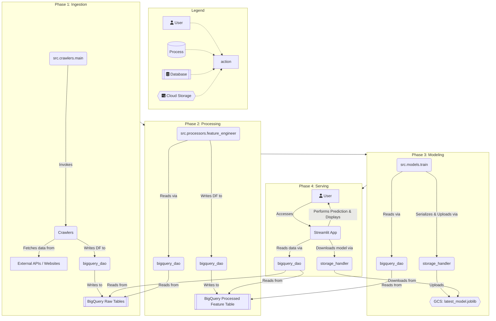

# 系統架構與數據流程 (ARCHITECTURE)

本文檔使用純技術語言，描述系統的目錄結構、數據流、處理邏輯與條件分支。

---

## 1. 目錄結構 (Directory Structure)

```
. (root)
├── src/                # 核心後端邏輯
│   ├── crawlers/       # 數據採集模組 (數據生產者)
│   │   ├── main.py     # 爬蟲總執行入口
│   │   └── *.py        # 各個獨立的爬蟲實作
│   ├── db_base/        # 數據存取層 (DAO - Data Access Object)
│   │   ├── bigquery_dao.py # 唯一與 BigQuery 互動的介面
│   │   └── storage_handler.py # 唯一與 GCS 互動的介面
│   ├── models/         # 機器學習模型模組
│   │   └── train.py    # 模型訓練腳本
│   ├── processors/     # 數據處理模組
│   │   └── feature_engineer.py # 特徵工程核心腳本
│   └── utils/          # 共用工具函式
├── pages/              # Streamlit 子頁面
│   ├── 01_predict_view.py # AI 預測頁
│   └── 02_history.py      # 歷史數據頁
├── streamlit_unit/     # Streamlit 前端共用元件
│   ├── query_func.py   # 專責向 DAO 請求數據的函式
│   └── mappings.py     # 欄位中英文對應表
├── Home.py             # Streamlit 應用主入口
├── config.yaml         # 全局配置文件 (定義特徵、參數等)
├── requirements.txt    # Python 依賴列表
└── ARCHITECTURE.md     # 本文件
```

---

## 2. 數據與邏輯流程 (Data & Logic Flow)

系統為事件驅動的線性流程，數據在 Google Cloud Platform (GCP) 內流動，由 DAO 層 (`bigquery_dao.py`, `storage_handler.py`) 統一管理所有 I/O 操作。

### **Phase 1: 數據採集 (Ingestion)**

1.  **觸發**: 執行 `src.crawlers.main`。
2.  **前置檢查**: `main.py` 協同各爬蟲模組，針對每個目標（如 `bid_info`, `financial_statement`），首先會向 BigQuery 查詢已存在的數據與最新日期。
3.  **條件分支**: 
    *   **If** 本次採集目標的標的與日期已存在於 BigQuery 中 -> **跳過 (SKIP)** 該次請求，避免重複寫入。
    *   **Else** -> **執行 (EXECUTE)** 採集。
4.  **執行**: 爬蟲透過 `requests` 或直接的 API Call 獲取外部數據源 (TWSE, MOPS, FinMind) 的原始數據 (JSON/HTML)，並在記憶體中將其處理為 Pandas DataFrame。
5.  **持久化**: 該 DataFrame 被傳遞給 `bigquery_dao.load_data()`。DAO 根據傳入的表格名稱，將 DataFrame 寫入 BigQuery 中對應的 `raw_*` 表格。此處不進行任何業務邏輯的轉換，僅做原始數據的鏡像儲存。

### **Phase 2: 特徵工程 (Processing)**

1.  **觸發**: 執行 `src.processors.feature_engineer.py`。
2.  **數據讀取**: 腳本透過 `bigquery_dao.load_data()`，從 BigQuery 讀取**所有**在 Phase 1 中採集到的 `raw_*` 表格，將它們載入為多個 Pandas DataFrames。
3.  **數據轉換**: 
    *   **Join**: 以 `bid_info` (競拍案) 為主表，將其他表格 (財務、營收、股價等) 根據證券代號與日期進行左連接 (Left Join)。
    *   **Calculation**: 根據 `config.yaml` 中定義的特徵列表，進行大量衍生計算。例如，`營收年增率 = (當期營收 - 去年同期營收) / 去年同期營收`。
    *   **Transformation**: 對偏態分佈的欄位應用 `skew_transformer` 進行對數或 Box-Cox 轉換。
    *   **Imputation**: 處理計算過程中產生的 `NaN` 或 `inf` 值。
4.  **持久化**: 生成一個包含數百個特徵的單一寬表 DataFrame (`all_features`)，並透過 `bigquery_dao.load_data()` 將其寫入 BigQuery 的 `processed_all_features` 表中。

### **Phase 3: 模型訓練 (Modeling)**

1.  **觸發**: 執行 `src.models.train.py`。
2.  **數據讀取**: 透過 `bigquery_dao` 從 BigQuery 讀取 `processed_all_features` 表。
3.  **數據分割**: 根據開標日期，將數據集切割為訓練集 (Training set) 與驗證集 (Validation set)，確保驗證集的時間發生在訓練集之後，防止數據洩漏。
4.  **模型訓練**: 實例化 `config.yaml` 中指定的模型 (如 XGBoost)，並在訓練集上執行 `.fit()` 方法。
5.  **持久化**: 訓練完成的模型物件 (e.g., `xgb_model`) 被 `joblib` 序列化為二進制檔案。`storage_handler.upload_file()` 被呼叫，將此模型檔案上傳至 Google Cloud Storage (GCS) 的指定路徑，並可能覆蓋名為 `latest_model.joblib` 的檔案。

### **Phase 4: 推理與呈現 (Inference & Serving)**

1.  **觸發**: 使用者透過瀏覽器訪問 Streamlit 應用。
2.  **應用初始化**: `Home.py` 或 `pages/*.py` 啟動時：
    *   呼叫 `storage_handler.download_file()` 從 GCS 下載 `latest_model.joblib` 模型檔案，並透過 `joblib.load()` 將其反序列化至記憶體中。此過程被 `@st.cache_resource` 緩存。
    *   透過 `streamlit_unit/query_func.py` 中被 `@st.cache_data` 緩存的函式，經由 `bigquery_dao` 從 BigQuery 讀取前端頁面所需的數據 (如當前競拍列表、歷史數據等)。
3.  **推理執行 (Predict View)**:
    *   使用者從下拉選單中選擇一個競拍標的。
    *   應用程式從已讀取的數據中，找到該標的對應的特徵向量 (a single row from `all_features`)。
    *   將該向量傳遞給記憶體中模型的 `.predict()` 方法。
4.  **結果呈現**: 
    *   推理結果 (如預測溢價率) 被格式化後顯示在前端。
    *   從資料庫讀取的數據，其欄位名會透過 `streamlit_unit/mappings.py` 中的字典轉換為中文，然後以 Plotly 圖表或表格形式呈現給使用者。

---

## 3. 流程圖 (Process Flowchart)

