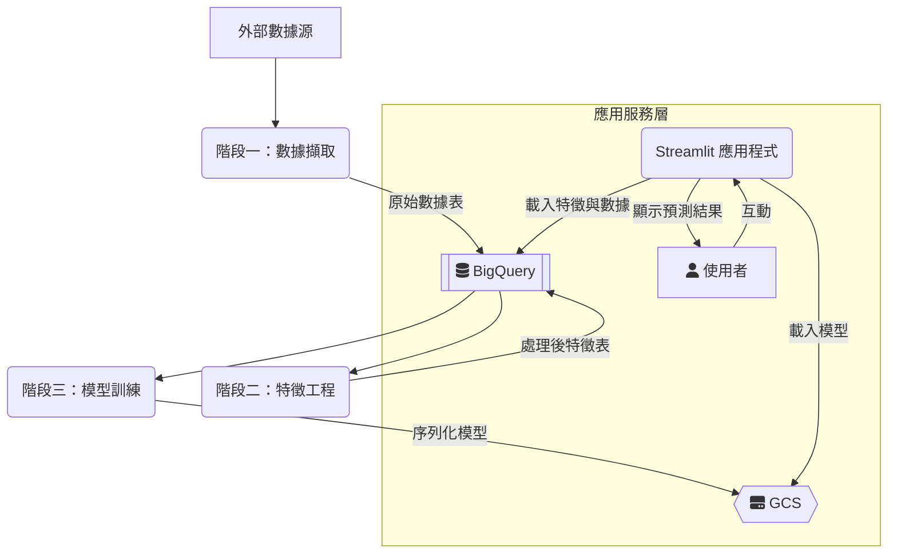

# AI 競拍大師 - 系統技術文件

一個全自動化系統，用於擷取台灣股票競拍數據、整合多來源資料進行特徵工程、訓練預測模型，並透過網頁應用提供預測服務。整個機器學習維運（MLOps）生命週期在 Google Cloud Platform (GCP) 生態系中進行管理。

---

## 系統架構與數據流程

本系統架構為一個線性的四階段 MLOps 管線。每個階段透過儲存在 BigQuery 和 GCS 中的數據狀態進行解耦，允許獨立執行與維護。

### 系統高階流程圖



### 處理流程階段

#### 1. 數據擷取 (Data Ingestion)

*   **目標：** 從分散的金融數據源收集並儲存原始數據。
*   **流程：**
    1.  由一個主腳本調用各個獨立的爬蟲模組。
    2.  每個模組針對一個特定的數據實體（例如：競拍資訊、財務報表、市場價格、月營收）。
    3.  透過查詢 BigQuery 中已存在的數據（基於股票代號與日期）來執行冪等性 (Idempotency) 檢查。
    4.  若數據為新的，則向外部數據源（TWSE、MOPS、FinMind）發起 HTTP 請求或 API 呼叫。
    5.  將原始響應（HTML/JSON）解析為 Pandas DataFrame。
    6.  該 DataFrame 被傳遞至數據存取物件（DAO），由其將未經修改的數據寫入 BigQuery 中對應的原始數據表。數據僅作附加，不覆寫。

#### 2. 特徵工程 (Feature Engineering)

*   **目標：** 將多個原始數據表轉換為單一、寬格式、可供模型使用的特徵矩陣。
*   **流程：**
    1.  流程被觸發後，從 BigQuery 讀取所有需要的原始數據表至記憶體中，成為多個 DataFrame。
    2.  以 `bid_info`（競拍資訊）表為主表，將所有其他表（財務、市場數據等）基於股票代號和相關時間鍵進行左連接 (Left Join)。
    3.  透過跨欄位計算，衍生出大量的特徵（例如：財務比率、成長率、移動平均線）。具體的特徵在一個中央配置文件中定義。
    4.  對具備偏態分佈的數值欄位應用對數或 Box-Cox 轉換，以校正其分佈。
    5.  對連接或計算過程中產生的缺失值（`NaN`, `inf`）採用預定義策略（例如：填補 0、中位數或一個常數）進行插補。
    6.  最終生成的統一寬表 DataFrame 被寫回 BigQuery，成為一個單獨的「已處理特徵」表。

#### 3. 模型訓練 (Model Training)

*   **目標：** 在最新的可用特徵上訓練一個預測模型，並將其持久化以供後續推理使用。
*   **流程：**
    1.  從 BigQuery 載入「已處理特徵」表。
    2.  基於時間順序鍵（例如：開標日期）將數據集分割為訓練集和驗證集，以防止數據洩漏並模擬真實世界的預測場景。
    3.  實例化一個梯度提升模型（例如：XGBoost），其超參數在配置文件中定義。
    4.  在訓練集上呼叫 `.fit()` 方法來訓練模型。
    5.  使用 `joblib` 將訓練好的模型物件進行序列化。
    6.  生成的二進制檔案透過儲存處理器上傳至 Google Cloud Storage (GCS) 的指定位置，通常會覆寫一個名為 `latest_model.joblib` 的檔案，以確保應用服務層總能獲取最新版本的模型。

#### 4. 推理與服務 (Inference & Serving)

*   **目標：** 提供一個互動式網頁介面，供使用者獲取進行中競拍事件的即時預測。
*   **流程：**
    1.  Streamlit 應用程式啟動。在首次運行時，它會連接到 GCP。
    2.  從 GCS 下載 `latest_model.joblib` 並將其反序列化到記憶體中。這個模型物件會被快取以供應用程式的整個生命週期使用。
    3.  從 BigQuery 查詢應用頁面所需的數據（例如：目前競拍列表、歷史數據、以及用於預測的預計算特徵）並進行快取。
    4.  當使用者從 UI 中選擇一個特定的股票時，應用程式從快取的數據中檢索其對應的特徵向量。
    5.  此向量被傳遞至記憶體中模型的 `.predict()` 方法。
    6.  最終的預測結果（例如：預測得標價）經過格式化後，顯示在使用者的螢幕上。

---

## 技術棧 (Technology Stack)

| 類別 | 技術 |
| :--- | :--- |
| **語言** | Python 3.9+ |
| **數據處理** | Pandas |
| **機器學習** | Scikit-learn, XGBoost, LightGBM |
| **網頁框架** | Streamlit |
| **雲端資料庫** | Google BigQuery |
| **雲端儲存** | Google Cloud Storage (GCS) |
| **核心平台** | Google Cloud Platform (GCP) |

---

## 操作指南

### 1. 環境配置
在專案根目錄下建立 `.env` 檔案，並填入您的 GCP 專案 ID 與憑證路徑。
```
PROJECT_ID="your-gcp-project-id"
GOOGLE_APPLICATION_CREDENTIALS="path/to/your/credentials.json"
```

### 2. 安裝依賴
```bash
pip install -r requirements.txt
```

### 3. 執行管線 (可選)
手動執行完整的數據管線：
```bash
# 階段一：擷取數據
python -m src.crawlers.main

# 階段二：進行特徵工程
python -m src.processors.main

# 階段三：訓練模型
python -m src.models.train
```

### 4. 啟動應用程式
```bash
streamlit run Home.py
```