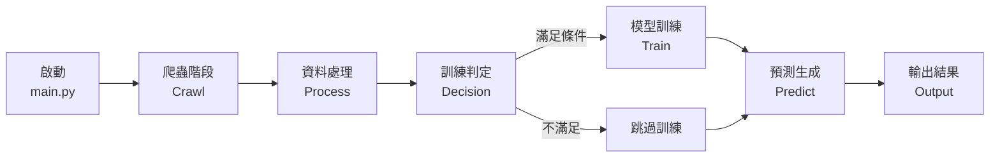
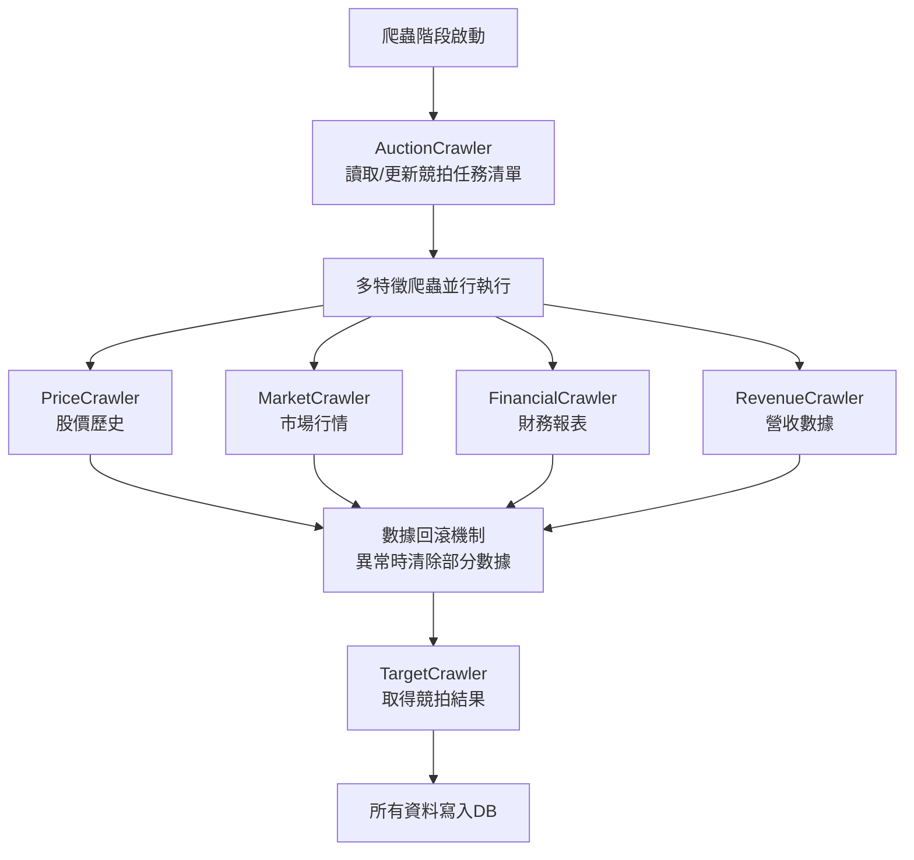
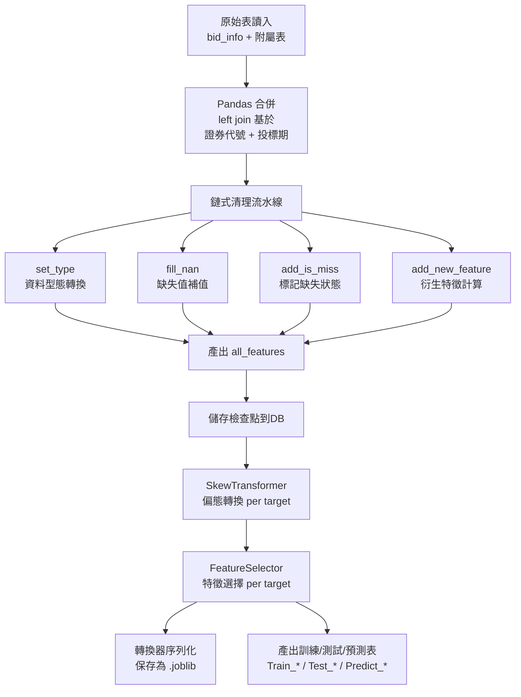
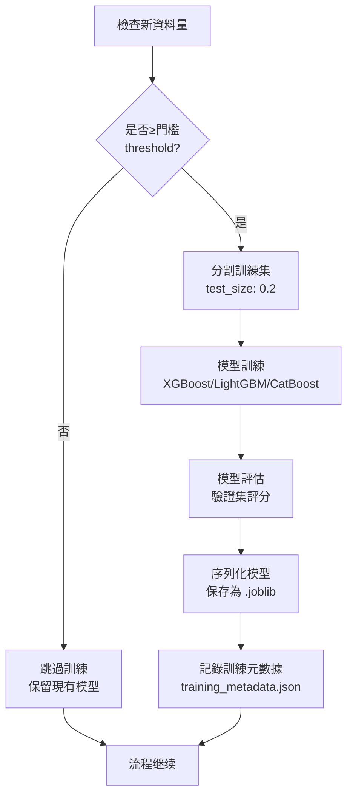
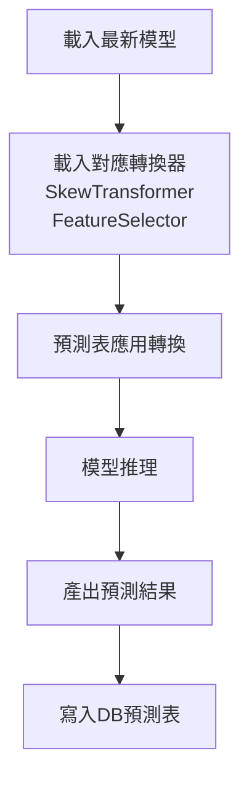
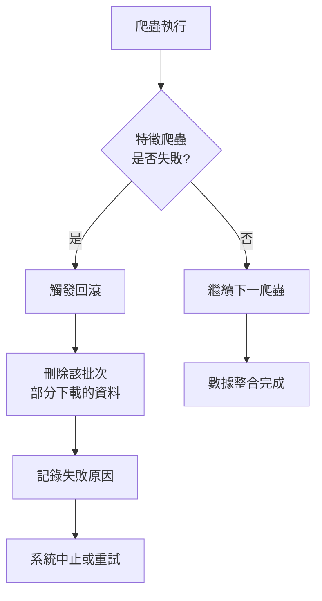

# Smart Bid Evaluator TWstock

台股競拍價格預測系統，透過自動化 ETL 流程整合多維度特徵數據，經過特徵工程與模型訓練產出預測結果。

## 1. 系統概述

### 核心功能

- **自動化資料擷取**: 多層爬蟲系統收集競拍資訊、財務報表、股價歷史、市場行情、營收數據
- **特徵工程與處理**: 自動化資料清理、缺失值補值、偏態轉換、特徵選擇
- **模型訓練**: 條件觸發型訓練機制，支援多個預測目標的獨立模型
- **預測與可視化**: 使用最新訓練模型產生預測，Streamlit 介面展示結果

### 架構設計原則

- **模組化解耦**: 各組件間透過資料庫為唯一介面，互相獨立
- **高內聚低耦合**: 爬蟲、處理、訓練、預測模組各司其職
- **可重現性**: 轉換器物件序列化儲存，確保訓練與預測過程一致

---

## 2. 系統流程

### 2.1 主流程架構



### 2.2 爬蟲階段詳細流程



### 2.3 資料處理管道



### 2.4 模型訓練階段



### 2.5 預測階段



### 2.6 異常處理機制



---

## 3. 資料流與模式

### 3.1 端到端資料轉換

| 階段 | 輸入 | 輸出 | 關鍵模組 |
|------|----|------|---------|
| **Crawl** | (無) | 多張原始表 (bid_info, history_price, fin_stmts 等) | src/crawlers/* |
| **Process** | 原始表 | all_features (寬表), Train_*/Test_*/Predict_* | src/processors/* |
| **Train** | Train_* / Test_* | 模型檔 + 轉換器檔 | src/models/train_model/* |
| **Predict** | Predict_* + 模型檔 | 預測結果 | src/models/train_model/predict.py |

### 3.2 關鍵設計決策

| 決策項 | 實踐方式 | 理由 |
|------|--------|------|
| **資料合併位置** | Pandas in-memory (應用層) | 降低 DB 負載，提升靈活性，中等規模下性能優 |
| **缺失值標記** | add_is_miss 特徵 | 缺失本身為預測信號 |
| **偏態轉換** | per-target 獨立转换器 | 金融資料常見偏態，提高模型穩定性 |
| **特徵選擇** | per-target 獨立選擇 | 不同預測目標所需特徵組合不同 |
| **轉換器序列化** | .joblib 儲存 | 確保訓練-預測一致性，消除 Training-Serving Skew |

---

## 4. 技術棧

| 層級 | 技術 | 版本範圍 |
|-----|------|--------|
| **語言** | Python | 3.9+ |
| **資料處理** | Pandas, NumPy | 見 requirements.txt |
| **爬蟲** | beautifulsoup4, curl_cffi, requests | 見 requirements.txt |
| **機器學習** | scikit-learn, XGBoost, LightGBM, CatBoost | 見 requirements.txt |
| **資料庫** | Google BigQuery / SQLite | 可配置切換 |
| **雲儲存** | Google Cloud Storage | GCS 或本地存儲可選 |
| **UI** | Streamlit | 見 requirements.txt |
| **工具** | FinMind API | 台股資料源 |

---

## 5. 快速啟動

### 5.1 環境準備

```bash
# 克隆倉庫
git clone <repo_url>
cd Smart-Bid-Evaluator_TWstock

# 建立虛擬環境
python -m venv venv
source venv/bin/activate  # Linux/Mac
# 或
venv\Scripts\activate      # Windows

# 安裝依賴
pip install -r requirements.txt
```

### 5.2 配置

1. **複製並編輯 config.yaml**

```bash
cp config.yaml.example config.yaml
```

編輯 `config.yaml` 設置：
- `storage.type`: `gcs` 或 `local`
- `database.type`: `bigquery` 或 `sqlite`
- GCP 認證路徑 (若使用 BigQuery/GCS)

2. **設置 GCP 認證** (如使用 BigQuery)

```bash
# 將 GCP 服務帳戶金鑰放入
mkdir -p json
cp /path/to/gcp-auth.json json/gcp-auth.json
```

### 5.3 執行

#### 選項 A: 完整流程 (依序執行所有階段)

```bash
python main.py --mode full
```

#### 選項 B: 單一階段
- **僅爬蟲**: `python main.py --mode crawl`
- **僅處理**: `python main.py --mode process`
- **僅訓練**: `python main.py --mode train`
- **僅預測**: `python main.py --mode predict`

#### 選項 C: 啟動 UI

```bash
streamlit run app.py
```

### 5.4 主要入口檔

| 檔案 | 用途 |
|-----|------|
| `main.py` | 命令行協調器，調度各階段執行 |
| `app.py` | Streamlit 主程式進入點 |
| `pages/` | Streamlit 多頁應用 |

---

## 6. 模組說明

### 6.1 爬蟲模組 (`src/crawlers/`)

| 爬蟲 | 功能 | 輸出表 |
|-----|------|--------|
| `AuctionCrawler` | 初始化/更新競拍任務清單 | auction_tasks |
| `PriceCrawler` | 股價歷史資料 | history_price |
| `MarketCrawler` | 市場行情指數 | market_info |
| `FinancialCrawler` | 財務報表 (盈利、資產等) | fin_stmts |
| `RevenueCrawler` | 營收數據 | revenue_info |
| `TargetCrawler` | 競拍結果 (承銷價等) | bid_info (目標值填充) |

### 6.2 處理模組 (`src/processors/`)

| 模組 | 功能 | 輸入 | 輸出 |
|-----|------|------|------|
| `FeatureEngineer` | 資料合併、清理、特徵擴增 | 原始表 | all_features |
| `SkewTransformer` | 學習並應用偏態轉換 | all_features | 轉換後資料 + .joblib 儲存 |
| `FeatureSelector` | 基於相關性/重要性選擇特徵 | all_features | 特徵子集 + .joblib 儲存 |

### 6.3 模型模組 (`src/models/`)

| 模組 | 功能 | 輸入 | 輸出 |
|-----|------|------|------|
| `train.py` | 模型訓練管道 | Train_* / Test_* | 模型檔 (.joblib) |
| `predict.py` | 預測推理 | Predict_* + 模型檔 | 預測結果 |

### 6.4 資料庫模組 (`src/db_base/`)

| 模組 | 用途 |
|-----|------|
| `db_manager.py` | DB 工廠類，返回 DAO 實例 |
| `bigquery_dao.py` | BigQuery 讀寫操作 |
| `sqlite_dao.py` | SQLite 讀寫操作 |
| `schemas.py` | 資料庫表結構定義 |

### 6.5 工具模組 (`src/utils/`)

| 模組 | 功能 |
|-----|------|
| `config_loader.py` | YAML 配置解析 |
| `logger_config.py` | 日誌設置 |
| `storage_handler.py` | GCS / 本地儲存統一介面 |
| `feature_utils.py`, `price_utils.py` 等 | 領域特化工具函數 |

---

## 7. 資料庫 Schema 概述

### 原始表 (Raw Tables)

爬蟲直接輸出，結構對應各資料源：
- `bid_info`: 競拍基本資訊 (證券代號、投標期、競拍日期等)
- `history_price`: 股價歷史
- `market_info`: 市場行情
- `fin_stmts`: 財務報表
- `revenue_info`: 營收數據

### 中間表 (Intermediate)

- `all_features`: 寬表，所有特徵整合結果，特徵工程檢查點

### 模型輸入表 (Model Input)

- `Train_<target>`: 訓練集，欄位為選定特徵 + 目標變數
- `Test_<target>`: 測試集
- `Predict_<target>`: 待預測集

---

## 8. 常見操作

### 8.1 只執行爬蟲

```bash
python main.py --mode crawl
```

### 8.2 重新訓練模型

```bash
python main.py --mode train
```

### 8.3 產生預測

```bash
python main.py --mode predict
```

### 8.4 檢查訓練元數據

```bash
cat json/training_metadata.json
```

### 8.5 切換資料庫 (SQLite)

編輯 `config.yaml`:
```yaml
database:
  type: "sqlite"
```

然後執行：
```bash
python main.py --mode crawl

## 9. 擴展與維運

### 9.1 容器化部署

```bash
# 建構 Docker 映像
docker build -t smart-bid-evaluator:latest .

# 以容器執行爬蟲階段
docker run -v /path/to/json:/app/json \
  -e DATABASE_TYPE=bigquery \
  smart-bid-evaluator:latest python main.py --mode crawl
```

### 9.2 分佈式處理升級

當資料規模達到億級時，建議替換：
- **Pandas** → **Dask** 或 **PySpark** (分佈式資料處理)
- **單機訓練** → **Ray Tune** 或 **Horovod** (分佈式訓練)

### 9.3 工作流編排

使用 **Apache Airflow** 或 **Argo Workflows** 排程：

```python
# 偽代碼示意
workflow = {
    'crawl': {...},
    'process': {'depends_on': 'crawl'},
    'train': {'depends_on': 'process'},
    'predict': {'depends_on': 'train'}
}
```

### 9.4 監控與日誌

- **日誌輸出**: `logging.INFO` 級別記錄各階段進度
- **訓練元數據記錄**: `json/training_metadata.json` 儲存每次訓練統計
- **錯誤追蹤**: 爬蟲失敗時自動回滾，詳細記錄異常原因

---

## 10. 檔案結構

```
.
├── ARCHITECTURE.md              # 詳細技術架構文件
├── README.md                    # 本檔 (系統說明書)
├── config.yaml                  # 配置檔 (DB、儲存、路徑)
├── main.py                      # 主協調器
├── app.py                       # Streamlit UI 進入點
├── requirements.txt             # Python 依賴列表

├── data/
│   ├── database/                # SQLite DB (選用)
│   └── example/                 # 範例資料
│       ├── all_feature_table.csv
│       ├── bid_info.csv
│       ├── fin_stmts.csv
│       ├── history_price_info.csv
│       └── revenue_info.csv

├── json/
│   ├── gcp-auth.json           # GCP 服務帳戶 (配置需)
│   └── training_metadata.json  # 訓練統計記錄

├── notebooks/                   # Jupyter 分析筆記本

├── pages/                       # Streamlit 多頁應用
│   ├── 00_Home.py
│   ├── 01_presict_view.py      # 預測結果查看
│   ├── 02_history.py           # 歷史資料
│   └── f_00_source.py          # 資料來源

├── streamlit_unit/              # Streamlit 輔助模組
│   ├── data_engine.py
│   ├── mappings.py
│   └── query_func.py

└── src/
    ├── __init__.py
    ├── crawlers/                # 爬蟲模組
    │   ├── __init__.py
    │   ├── base_crawler.py      # 爬蟲基類
    │   ├── auctioncrawler.py    # 競拍信息爬蟲
    │   ├── pricecrawler.py      # 股價爬蟲
    │   ├── marketcrawler.py     # 市場爬蟲
    │   ├── financialcrawler.py  # 財務爬蟲
    │   ├── revenuecrawler.py    # 營收爬蟲
    │   └── targetcrawler.py     # 目標值爬蟲

    ├── db_base/                 # 資料庫抽象層
    │   ├── __init__.py
    │   ├── db_manager.py        # DB 工廠 (選擇 BigQuery/SQLite)
    │   ├── schemas.py           # 共用 schema 定義
    │   ├── bigquery_dao.py      # BigQuery DAO
    │   ├── bigquery_schemas.py  # BigQuery schema
    │   └── sqlite_dao.py        # SQLite DAO

    ├── models/                  # ML 模型模組
    │   ├── __init__.py
    │   ├── saved_weights/       # 訓練後模型儲存
    │   └── train_model/
    │       ├── __init__.py
    │       ├── train.py         # 訓練管道
    │       ├── predict.py       # 預測引擎
    │       └── boost_automl.py  # 自動化 ML 配置

    ├── processors/              # 特徵工程模組
    │   ├── __init__.py
    │   ├── feature_engineer.py  # 主特徵工程 (合併、清理、擴增)
    │   ├── feature_selector.py  # 特徵篩選
    │   └── skew_transformer.py  # 偏態轉換

    └── utils/                   # 工具函數
        ├── __init__.py
        ├── config_loader.py     # YAML 配置加載
        ├── logger_config.py     # 日誌配置
        ├── storage_handler.py   # 儲存層統一介面
        ├── finmind_manager.py   # FinMind API 管理
        ├── feature_utils.py     # 通用特徵工具
        ├── price_utils.py       # 股價工具
        ├── financial_format_utils.py  # 財務數據格式化
        ├── market_utils.py      # 市場工具
        ├── revenue_utils.py     # 營收工具
        └── target_utils.py      # 目標變數工具
```

---

## 11. 依賴與版本需求

詳見 [requirements.txt](requirements.txt)。主要依賴：

- **Pandas >= 1.3.0**: 資料操作
- **NumPy >= 1.21.0**: 數值運算
- **scikit-learn >= 0.24.0**: ML 工具
- **XGBoost >= 1.5.0**: Gradient Boosting 模型
- **LightGBM >= 3.2.0**: 輕量 Boosting 模型
- **CatBoost >= 1.0.0**: 分類 Boosting
- **google-cloud-bigquery >= 3.0.0**: BigQuery 客戶端
- **Streamlit >= 1.0.0**: Web UI 框架
- **beautifulsoup4 >= 4.9.0**: HTML 解析
- **finmind >= 1.9.0**: 台股資料 API

---

## 12. 故障排查

### 問題: BigQuery 認證失敗

**解決方案**: 
1. 檢查 `json/gcp-auth.json` 路徑是否正確
2. 驗證服務帳戶金鑰有 BigQuery 和 GCS 權限
3. 設定環境變數: `export GOOGLE_APPLICATION_CREDENTIALS=json/gcp-auth.json`

### 問題: 爬蟲超時或連線失敗

**解決方案**:
1. 檢查網路連線
2. 確認 `config.yaml` 中的 `user_agent` 未被伺服器阻擋
3. 調整爬蟲重試次數和超時時間 (見各爬蟲實現)

### 問題: 記憶體溢出 (OOM)

**解決方案**:
1. 減小單次爬蟲的批次大小
2. 分期執行各階段 (而非一次全部)
3. 升級至 Dask/Spark 進行分佈式處理

### 問題: 特徵選擇後特徵數過少

**解決方案**:
1. 調整 `FeatureSelector` 的選擇閾值
2. 檢查 `all_features` 表的資料品質
3. 回顧特徵篩選的依據指標 (相關性/重要性)

---

## 13. 參考文件

- [ARCHITECTURE.md](ARCHITECTURE.md): 深入架構設計說明
- [config.yaml](config.yaml): 配置選項說明
- **FinMind API 文檔**: https://finmind.github.io
- **Google BigQuery 文檔**: https://cloud.google.com/bigquery/docs
- **Streamlit 文檔**: https://docs.streamlit.io

---

## 14. 授權

本專案遵循相關開源授權協議。詳見 LICENSE 檔案。

---

**最後更新**: 2026-03-25
