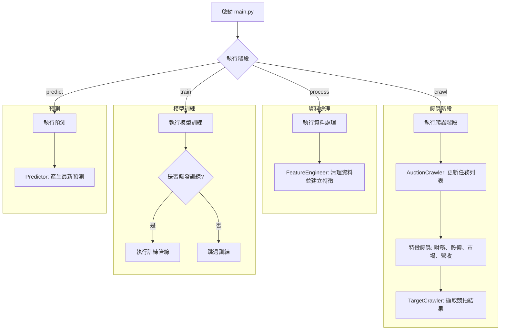

# 台股競拍價格預測系統

**專案願景:** 運用數據工程與機器學習技術，精準預測台股競拍價格，為投資者提供數據驅動的決策優勢。

---

## 主要工作流程

整個流程由 `main.py` 統一調度，它作為多階段數據管線的中央指揮官。本工作流程設計穩健，具備明確的職責分離、全面的日誌記錄與優雅的錯誤處理機制。



### 異常處理與日誌

- **集中式異常處理:** `main` 函式被一個 `try...except` 區塊包覆，用於捕捉各獨立階段中任何未被處理的異常。這能防止整個應用程式崩潰，並為偵錯提供清晰的追蹤記錄。
- **階段級錯誤處理:** 每個主要階段（如 `run_crawling_stage`）都有自己的 `try...except` 區塊。在爬蟲階段，這包含一個穩健的資料回滾機制。若任一特徵爬蟲失敗，系統將自動刪除該批次中已部分下載的資料，以確保資料的完整性。
- **日誌記錄:** 應用程式使用 `print` 語句為每個階段提供詳細的日誌，包括任務數量、當前操作及每個步驟的狀態。這使得對管線的監控和偵錯變得容易。

---

## 核心功能

- **自動化爬蟲:** 使用一個穩健的多階段爬蟲管線，自動從台灣證券交易所及其他來源擷取競拍資料。
- **多維度特徵整合:** 整合了廣泛的特徵，包括財務報表、歷史股價、市場數據和營收報告。
- **智慧訓練觸發:** 只有當收集到足夠數量的新資料時，才會自動觸發模型訓練流程，以優化計算資源。
- **模組化與可擴充性:** 專案採模組化結構，使得新增爬蟲、特徵或模型變得容易。
- **資料庫整合:** 使用 BigQuery 進行可擴展且可靠的資料儲存與檢索。

---

## 技術棧

- **Python 3.9+**
- **函式庫:**
    - **Pandas:** 用於資料操作與分析。
    - **google-cloud-bigquery:** 用於與 BigQuery 資料庫互動。
    - **scikit-learn, XGBoost, LightGBM:** (預期) 用於模型訓練與預測。
- **資料庫:**
    - **Google BigQuery**

---

## 未來擴展與優化方向

為將本專案從一個功能完善的原型發展為一個能夠在生產環境中長期、穩定、高效運作的系統，以下是幾個潛在的擴展和優化方向：

### 1. MLOps 生命週期管理
*   **模型註冊與版本控制**: 導入模型註冊中心 (如 MLflow Model Registry, Vertex AI Model Registry)，集中管理模型版本、元數據和性能指標。
*   **自動部署與監控**: 建立自動化管道，實現模型的自動訓練、部署 (如部署為線上預測服務) 和持續監控，追蹤模型在生產環境中的性能、資料漂移和概念漂移。
*   **實驗追蹤**: 整合 MLflow 或 Weights & Biases 等工具，對所有訓練實驗的參數、指標、代碼版本和人工製品進行集中追蹤和可視化。

### 2. 資料管道的擴展性與健壯性
*   **爬蟲的全面彈性**: 在 `base_crawler.py` 中增加通用的錯誤重試機制（例如指數退避），以增強對外部 API 不穩定性和網路錯誤的應對能力。
*   **資料驗證與品質檢查**: 在資料獲取和特徵工程階段，引入更嚴格的資料驗證和品質檢查機制，確保資料的準確性、完整性和一致性。
*   **Schema 演進管理**: 對於 BigQuery 的生產表格，採用明確的 DDL 操作或 Schema 遷移工具，而非僅依賴自動推斷，以更嚴謹地管理 Schema 的演進。
*   **大型資料處理**: 當資料量顯著增長時，考慮將 `feature_engineer.py` 中的部分 Pandas 記憶體內操作遷移到分散式運算框架 (如 PySpark, Dask) 或直接利用 BigQuery 的 SQL 能力進行大規模 ETL。
*   **特徵儲存 (Feature Store)**: 引入專用的 Feature Store，統一管理特徵的定義、計算邏輯和版本，確保訓練和預測時特徵的一致性，提升特徵重用性。

### 3. 系統監控與告警
*   **全面的系統監控**: 整合雲端監控服務 (如 Google Cloud Monitoring) 或 Prometheus/Grafana，監控各階段的資源使用情況、執行時間和成功率。
*   **異常自動告警**: 建立自動化告警機制 (如發送至 PagerDuty, Slack, Email)，在爬蟲失敗、資料品質異常、模型訓練失敗或預測服務出現問題時，即時通知相關人員。

### 4. 程式碼工程與可維護性
*   **更細緻的錯誤處理**: 在關鍵的程式碼路徑中，捕獲更具體的異常，並實現定制化的錯誤處理或重試邏輯。
*   **統一配置管理**: 除了 `config.yaml`，考慮使用環境變數或專用的配置服務來管理敏感資訊和生產配置。
*   **全面的測試策略**: 擴展現有的測試覆蓋，包括單元測試、整合測試和端到端測試，確保每個模組和整個流程的穩定性。

---

## 快速上手

### 1. 環境變數

在專案根目錄下建立一個 `.env` 檔案，並填入您的資料庫憑證：

```
# .env

# BigQuery
GCP_PROJECT_ID="your-gcp-project-id"
GCP_DATASET_ID="your-dataset-id"
```

### 2. 安裝

使用 pip 安裝所需的依賴套件：

```bash
pip install -r requirements.txt
```

### 3. 執行

您可以使用命令列參數執行整個管線或單獨的階段。

**執行整個管線:**

```bash
python main.py
```

**執行特定階段:**

```bash
# 僅執行爬蟲和資料處理階段
python main.py crawl process

# 強制重新訓練模型，無論新資料量是否達到門檻
python main.py train
```

---

## 檔案結構

```
.
├── ARCHITECTURE.md
├── README.md
├── check_undefined.py
├── config.yaml
├── data
│   └── example
│       ├── all_feature_table.csv
│       ├── all_market_info.csv
│       ├── bid_info.csv
│       ├── fin_stmts.csv
│       ├── history_price_info.csv
│       ├── revenue_info.csv
│       └── target_variable.csv
├── json
│   └── training_metadata.json
├── list_db_schema.py
├── main.py
├── migrate_sqlite_to_bq.py
├── requirements.txt
├── src
│   ├── __init__.py
│   ├── crawlers
│   │   ├── __init__.py
│   │   ├── auctioncrawler.py
│   │   ├── base_crawler.py
│   │   ├── financialcrawler.py
│   │   ├── marketcrawler.py
│   │   ├── pricecrawler.py
│   │   ├── revenuecrawler.py
│   │   └── targetcrawler.py
│   ├── db_base
│   │   ├── __init__.py
│   │   ├── bigquery_dao.py
│   │   ├── bigquery_schemas.py
│   │   ├── db_manager.py
│   │   ├── schemas.py
│   │   └── sqlite_dao.py
│   ├── models
│   │   ├── __init__.py
│   │   └── train_model
│   │       ├── __init__.py
│   │       ├── boost_automl.py
│   │       ├── predict.py
│   │       └── train.py
│   ├── processors
│   │   ├── __init__.py
│   │   ├── feature_engineer.py
│   │   ├── feature_selector.py
│   │   └── skew_transformer.py
│   └── utils
│       ├── __init__.py
│       ├── config_loader.py
│       ├── feature_utils.py
│       ├── financial_format_utils.py
│       ├── finmind_manager.py
│       ├── logger_config.py
│       ├── market_utils.py
│       ├── price_utils.py
│       ├── revenue_utils.py
│       ├── storage_handler.py
│       └── target_utils.py
├── test.py
├── test_bigquery_dao.py
└── test_改欄位名稱.py
```
